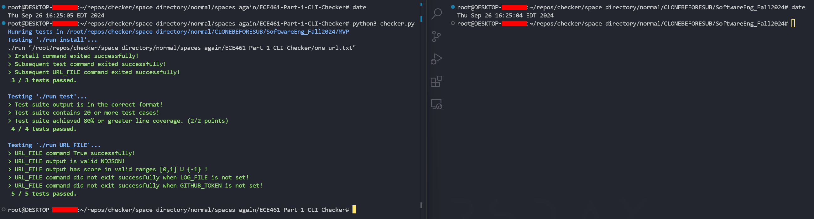

# MVP

# TEAM DSINC

## 🌟 Rubric items

### Purpose

-   The purpose of this project is to create software that scores modules based on various metrics.

### Configuration

-   Please see 'Running with Checker' to run with the checker.
-   Please see 'Devs start here!' for sys configs for development and other information

### Valid Input

-   Valid input can be described as a list of urls. Most strings in a txt file should not cause problems. You can pass in an absolute path when using the bash script. You can also modify `src/Input/example.txt` when running with `npm run dev` and not adding a url file path to your command.

Example Below:

```
https://www.npmjs.com/package/queue-lit
https://www.npmjs.com/package/comment-json
https://github.com/BellDorian/SoftwareEng_Fall2024
https://www.npmjs.com/package/@ant-design/colors
https://www.typescriptlang.org/docs/handbook/functions.html
https://www.npmjs.com/package/@rspress/shared
https://www.youtube.com/watch?v=dQw4w9WgXcQ
https://www.npmjs.com/package/query-string
https://www.npmjs.com/package/@atom-ide-community/atom-package-manager
https://github.com/Cinnamon/kotaemon
https://github.com/Z4nzu/hackingtool
https://www.npmjs.com/package/@hey-api/client-fetch
https://www.npmjs.com/package/@ckb-ccc/core
https://www.npmjs.com/package/axios
https://www.npmjs.com/package/body-parser
https://www.npmjs.com/package/helmet
https://www.npmjs.com/package/async
https://www.npmjs.com/package/chalk
https://www.npmjs.com/package/cors
https://www.npmjs.com/package/jsonwebtoken

```

### Valid Output

-   The format for valid output is an NDJSONRow with keys that match up to the casing required by the checker.
-   Here is the type for our NDJSONRow that is used with our Repository Object

NDJSONRow type:

```ts
export type NDJSONRow = Partial<{
    URL: string;
    NetScore: number;
    NetScore_Latency: number;
    RampUp: number;
    RampUp_Latency: number;
    Correctness: number;
    Correctness_Latency: number;
    BusFactor: number;
    BusFactor_Latency: number;
    ResponsiveMaintainer: number;
    ResponsiveMaintainer_Latency: number;
    License: number;
    License_Latency: number;
}>;
```

Example Below:

```
{"URL":"https://www.npmjs.com/package/queue-lit","NetScore":0.08077500000000001,"NetScore_Latency":1090.5285,"RampUp":0.1631,"RampUp_Latency":0.091,"Correctness":0,"Correctness_Latency":3.2499,"BusFactor":0.1,"BusFactor_Latency":1085.3571,"ResponsiveMaintainer":0,"ResponsiveMaintainer_Latency":0.0517,"License":1,"License_Latency":0.1008}
{"URL":"https://www.npmjs.com/package/comment-json","NetScore":0,"NetScore_Latency":332.1649,"RampUp":1,"RampUp_Latency":0.0034,"Correctness":0.49,"Correctness_Latency":1.6363,"BusFactor":0.2,"BusFactor_Latency":329.6298,"ResponsiveMaintainer":0.16071428571428573,"ResponsiveMaintainer_Latency":0.0066,"License":0,"License_Latency":0.0024}
{"URL":"https://www.npmjs.com/package/@ant-design/colors","NetScore":0.5027115384615385,"NetScore_Latency":293.3914,"RampUp":0.317,"RampUp_Latency":0.0049,"Correctness":1,"Correctness_Latency":1.816,"BusFactor":0.4,"BusFactor_Latency":289.7159,"ResponsiveMaintainer":0.1346153846153846,"ResponsiveMaintainer_Latency":0.0053,"License":1,"License_Latency":0.0017}
```

## 🌟 Running with checker 🌟

The path to the repository is the MVP folder, not the base folder when cloned.

Example: `REPO_PATH = "/root/repos/checker/space directory/normal/CLONEBEFORESUB/SoftwareEng_Fall2024/MVP"`

Ensure environment has node/npm

NPM/Node Installation:

-   [Download and install here](https://nodejs.org/en/download/prebuilt-installer)
-   [npm Docs](https://docs.npmjs.com/downloading-and-installing-node-js-and-npm)

Check NPM/Node Installation:

-   `npm --version`
-   `node --version`
-   If npm & node are installed correctly you should see matching versions from the Download Node.js® page.
-   I am using node v22.1.0 and npm v10.7.0, not sure if the newest versions break any current configs or not.

Ensure correct permissions on run file (in MVP directory):

-   `chmod +x run`

The usual commands that the checker requests are available:

-   `./run install`
-   `./run test`
-   `./run {path to url file}`



## 🌟 Devs Start here! 🌟

### Dependencies

NPM/Node Installation:

-   [Download and install here](https://nodejs.org/en/download/prebuilt-installer)
-   [npm Docs](https://docs.npmjs.com/downloading-and-installing-node-js-and-npm)

Check NPM/Node Installation:

-   `npm --version`
-   `node --version`
-   If npm & node are installed correctly you should see matching versions from the Download Node.js® page.
-   I am using node v22.1.0 and npm v10.7.0, not sure if the newest versions break any current configs or not.

Install Dependencies:

-   Open terminal in your IDE, use powershell, terminal of preference, etc..
-   cd into the MVP directory.
-   `cd path/to/MVP`
-   Install dependencies using npm
-   `npm install`

### Run

Running nodemon:

-   In your terminal in the MVP directory run the following command:
-   `npm run dev`
-   This command (in package.json under the key "scripts) will start nodemon and watch files within the src/ directory.
-   Any changes you make will be watched, and executed in your terminal.

Try out live changes (while npm run dev is still running):

-   Paste the following in src/index.ts.

```ts
console.log('some text');
```

-   Save your changes to see the new output in the console

### Optional Prettier Install

If using VSCode install the extension prettier. I have already added my config as a dev dependency. After enabling formatting on save your files will be auto-formatted according to that standard. I don't see this as required it just makes diffs on git much easier to read if we work within the same file and helps keep code readable.

If anyone needs any help, has any questions, etc don't hesitate to reach out!

put output.txt back for run file before submission

## 🌟 General MVP Information 🌟

### Running without building

Can use nodemon for this:

-   `npm install`
-   `npm run dev`

### Manual build

We have a build script for this:

-   `npm run build`

### Various test configs

We have two test configurations, to switch between the two swap the script that npm run test runs:

-   muted output: `test:jest:mute`
-   verbose output: `test:jest:verbose`

### Where is everything?

Inside MVP folder

-   Distribution `dist/`
-   Coverage `coverage/`
-   Logs `Logs/`
-   Entry `index.ts`
-   ISO dumps `REPO_DUMP/` (should remain empty)
-   File Results `results/`
-   Node Modules `node_modules/`
